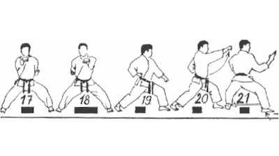
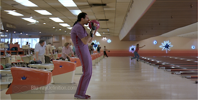
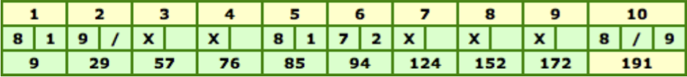

# Bowling Game Kata in Clojure

This Kata was run at the Paris Clojure User Group along with a presentation about [Data Literals](https://speakerdeck.com/jgrodziski/why-data-literals-matters).

## Bowling Game Domain and Rules

The game consists of **10 frames** as shown above. In each frame the player has
two opportunities to knock down 10 pins. The score for the frame is the total
number of pins knocked down, plus bonuses for strikes and spares.

A **spare** is when the player knocks down all 10 pins in two tries. The **bonus** for that frame is the number of pins knocked down by the next roll. ‘/’ denote a spare in the score sheet.
A **strike** is when the player knocks down all 10 pins on his first try. The **bonus** for that frame is the value of the next two balls rolled. ‘X’ denote a striker in the score sheet.

In the **tenth frame** a player who rolls a spare or strike is allowed to roll the **extra balls** to complete the frame (so 3 balls can be rolled in tenth frame).

## Tests

The project uses [Midje](https://github.com/marick/Midje/).

`lein midje` will run all tests.

`lein midje namespace.*` will run only tests beginning with "namespace.".

`lein midje :autotest` will run all the tests indefinitely. It sets up a
watcher on the code files. If they change, only the relevant tests will be
run again.